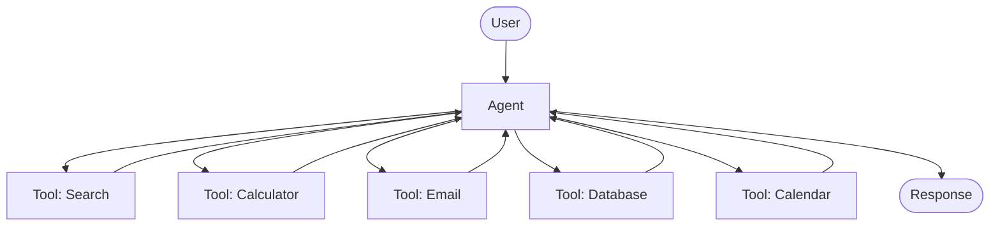
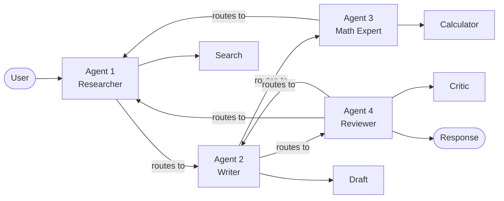
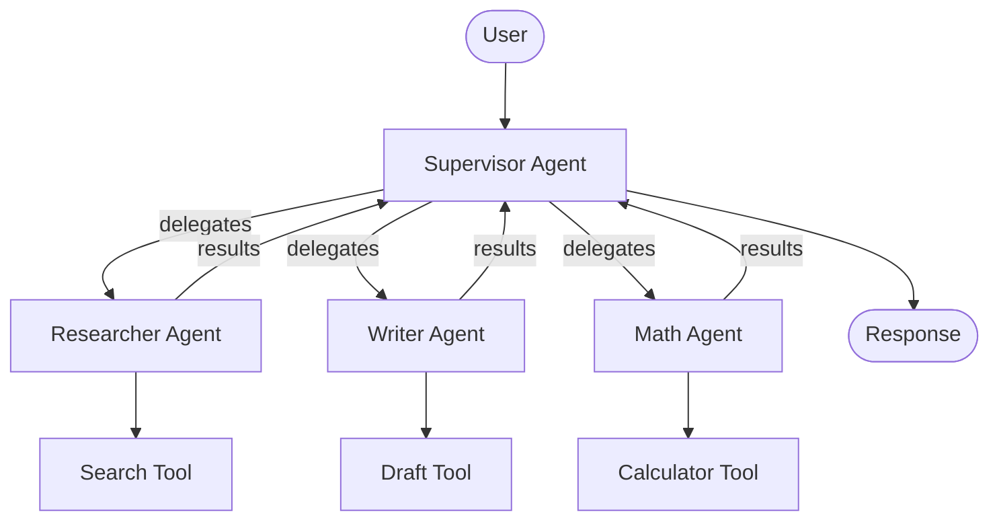
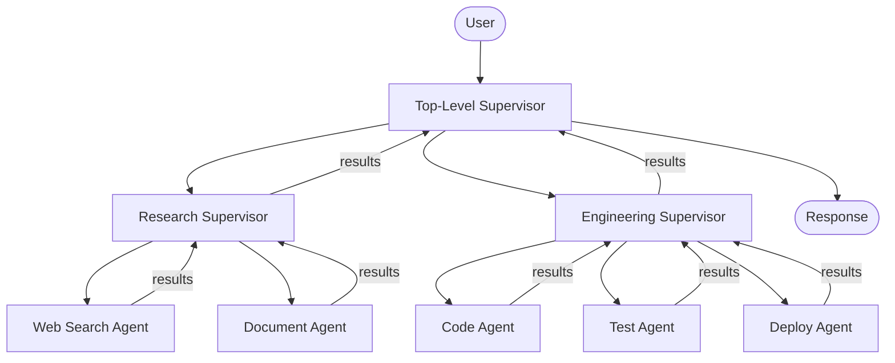
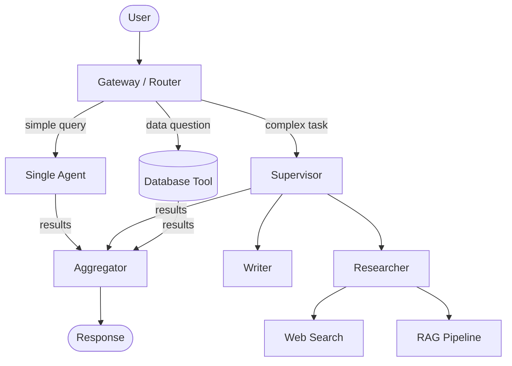

## Part 1: Agentic Architecture Patterns

### What is an Agent?

At its core, an **agent is an LLM that calls tools**. The design of how agents are structured and how they communicate with each other has a significant impact on reliability, cost, and performance.

---

### Architecture 1: Single Agent Systems

A single agent has access to all available tools and handles everything on its own.

**Problems:**

- Too many tools leads to poor decision-making. The sweet spot is roughly **5-10 tools** per agent.
- As tools increase, so does context size, overwhelming the context window and increasing hallucinations.
- A single agent struggles to handle multiple specialization areas (e.g., planning, research, math) simultaneously.

**Real-world examples:**

- A simple customer support chatbot that can look up orders, check FAQs, and issue refunds -- all within a small, well-scoped tool set.
- A coding assistant (like early Copilot Chat) that answers questions, runs code, and reads files, but within a narrow context.
- A personal productivity assistant that manages your calendar, sends emails, and sets reminders.

---

### Architecture 2: Network of Agents (Swarm)

Each agent has its own tools, and agents communicate by deciding who acts next, with no central controller.

> The term *swarm* is borrowed from swarm intelligence (think ant colonies). It refers to a decentralized, multi-agent system where coordination emerges from agent-to-agent interactions rather than a central authority. It's a loose term with no single agreed-upon definition.

**Problem:** Any agent can route to any other agent at any time. The lack of centralization leads to unreliable results, longer execution times, and higher costs.

**Real-world examples:**

- OpenAI's early experiments with agent swarms for open-ended research tasks, where agents self-organized to divide and tackle subtasks.
- Generative game AI where NPCs coordinate behaviors with each other without a central controller, like in Stanford's "Smallville" simulation paper.
- Experimental multi-agent debate systems where multiple LLM agents argue positions and respond to each other to arrive at a consensus.

---

### Architecture 3: Supervisor Agent

A single **supervisor agent** is responsible for routing tasks to specialized subagents. The supervisor thinks about *who* to call next; subagents focus solely on *doing their job*.

- Subagents can also be treated as tools within a larger system.
- Centralized control leads to more predictable and reliable behavior.

**Real-world examples:**

- LangGraph's recommended multi-agent pattern, where a top-level orchestrator routes between a researcher agent, a writer agent, and a critic agent to produce long-form content.
- Enterprise automation pipelines where a supervisor delegates to a data-fetching agent, a formatting agent, and an email-sending agent to generate and distribute reports.
- AI coding tools like Devin, where a planner agent coordinates between subagents handling file editing, terminal commands, and browser testing.

---

### Architecture 4: Hierarchical Approach

The supervisor model extended recursively: a supervisor spawns subagents, which can themselves act as supervisors with their own subagents.

This allows agents to organize into specialized clusters, handling complex, nested workflows.

**Real-world examples:**

- Large-scale autonomous research systems (like AutoGPT or OpenDevin) where a top-level goal gets broken into subgoals, each managed by its own sub-supervisor with specialized workers.
- Complex enterprise workflows, such as an AI system that manages an entire software release: a top-level agent coordinates a testing supervisor (which manages unit, integration, and e2e test agents) alongside a deployment supervisor (which manages staging and production agents).
- Multi-department AI assistants in large organizations, where a company-wide orchestrator delegates to department-level supervisors (HR, Finance, Engineering), each running their own subagents.

---

### Architecture 5: Fully Custom Architecture *(most common)*

In practice, the most effective architecture is one **tailored to the specific domain**. Custom architectures are the most common choice precisely because no single pattern fits every use case.

**Real-world examples:**

- Cursor and other AI IDEs, which use a custom blend of single-agent tool use, retrieval, and multi-step planning tuned specifically for the code editing context.
- Perplexity AI, which combines web search, retrieval, and generation in a pipeline that doesn't fit neatly into any standard architecture.
- Most production AI agents at companies like Stripe, Notion, or LinkedIn, where teams design bespoke orchestration logic around their specific data sources, APIs, and user workflows.

---

### Additional Nuances

When one agent calls another, there are two communication patterns:

| Dimension                    | Option A                                  | Option B             |
| ---------------------------- | ----------------------------------------- | -------------------- |
| **What gets passed**   | Full graph state                          | Just tool parameters |
| **What gets returned** | Tool calls, reasoning, and final response | Final response only  |

---
