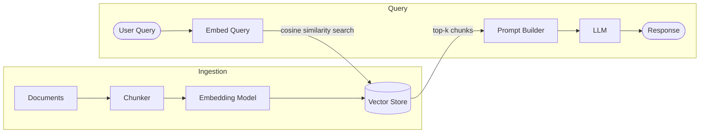
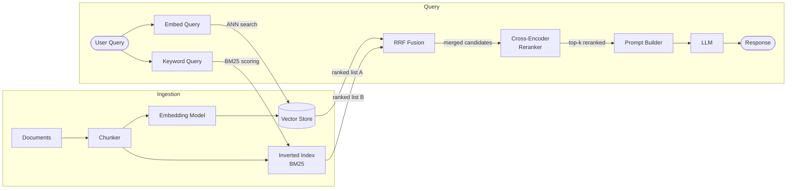
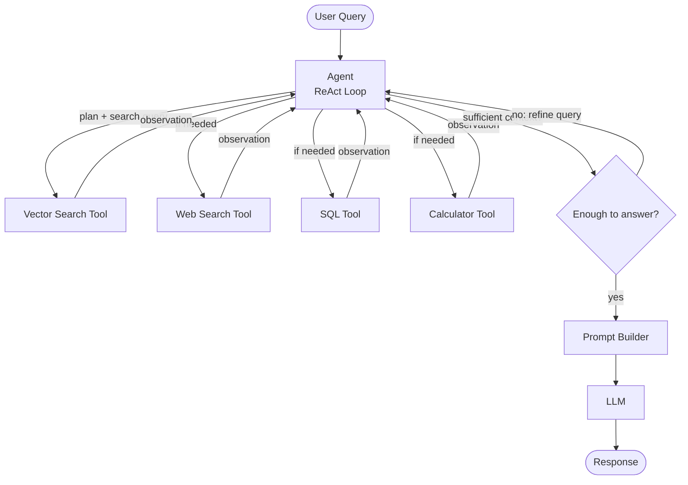

## Part 2: RAG Systems

RAG (Retrieval-Augmented Generation) is a technique where relevant information is retrieved from a knowledge base and handed to the LLM to generate a grounded answer. Rather than relying solely on what the model learned during training, RAG grounds responses in external data at inference time.

### Core Concepts (Shared Across All RAG Types)

Before diving into the variants, it helps to understand the building blocks that every RAG system is built on.

**Chunking**

Documents are too large to fit into a prompt wholesale, so they are split into smaller pieces called *chunks*. Chunk size is a tunable parameter -- too small and you lose context, too large and you introduce noise. Common strategies include fixed-size chunking (e.g., 512 tokens with overlap), sentence-level splitting, and recursive character splitting.

**Embeddings**

Each chunk is passed through an embedding model (e.g., `text-embedding-3-small` from OpenAI, or `bge-large` from HuggingFace) which converts it into a high-dimensional vector -- a list of floating point numbers that encodes the semantic meaning of the text. Chunks that are semantically similar end up with vectors that are close together in this high-dimensional space.

**Vector Stores**

These embedding vectors are stored in a vector database (e.g., Pinecone, Weaviate, pgvector, Chroma). At query time, the user's question is also embedded, and the vector store retrieves the chunks whose vectors are closest to the query vector, typically using **cosine similarity** or **dot product** as the distance metric.

**The Retrieval-Generation Pipeline**

```
User query
   |
   v
Embed query --> Vector search --> Top-k chunks
                                      |
                                      v
                              Inject into prompt --> LLM --> Final answer
```

The retrieved chunks are injected into the LLM's prompt as context, and the model generates an answer grounded in that retrieved information.

---

### Naive RAG

*The baseline approach.*

> Think of it like an open-book exam with sticky notes.



**How it works:**

1. Pre-read all documents and write "sticky notes" (embeddings) for each chunk.
2. A question comes in.
3. Find the sticky notes most semantically similar to the question.
4. Hand those notes to the LLM: "Answer using these."

**Technical details:**

The retrieval step is a single **approximate nearest neighbor (ANN) search** over the vector store. Libraries like FAISS use ANN algorithms (e.g., HNSW -- Hierarchical Navigable Small World graphs) to make this search fast even over millions of vectors, trading a small amount of accuracy for a large gain in speed.

The top-k chunks (typically k=3 to 10) are concatenated into the prompt. The model sees something like:

```
Context:
[Chunk 1] ...
[Chunk 2] ...
[Chunk 3] ...

Question: What is the refund policy?
Answer:
```

**Weaknesses:**

- Retrieval is purely similarity-based. A query like "What did the CEO say last quarter?" might retrieve chunks that *sound* relevant but miss the actual quote if the wording doesn't align well with the embedding space.
- No mechanism to verify whether the retrieved chunks are actually sufficient to answer the question.
- Chunk boundaries can cut off important context.

**Real-world examples:**

- Early versions of document Q&A tools (like simple PDF chatbots) that embed a document and answer questions over it with a single vector lookup.
- Basic internal knowledge base assistants that retrieve the closest FAQ entry and generate a response from it.
- Entry-level customer support bots that match a user's question to the nearest help article using embeddings.

---

### Hybrid RAG

*Same open-book exam, but smarter search.*



**How it works:**

1. Same chunking and storage setup.
2. A question comes in.
3. Run **two searches in parallel:**
   - **Semantic search** (embeddings) -- finds conceptually related chunks
   - **Keyword search** (BM25) -- finds exact word matches
4. Merge and rerank the results from both.
5. Hand the best combined results to the LLM.

**Technical details:**

**BM25 (Best Match 25)** is a classical information retrieval algorithm that scores documents based on term frequency and inverse document frequency (TF-IDF), with length normalization. It excels at exact keyword matching, which dense embeddings can miss -- especially for rare terms, proper nouns, or technical jargon.

The two result sets are merged using **Reciprocal Rank Fusion (RRF)**, a simple but effective algorithm that combines ranked lists without needing to normalize scores across different scales:

```
RRF_score(chunk) = sum over each ranker of: 1 / (k + rank)
```

Where `k` is a constant (typically 60) that dampens the impact of very high ranks. Chunks that appear near the top in *both* rankings get boosted.

After fusion, a **cross-encoder reranker** (e.g., Cohere Rerank, or a local `ms-marco` model) is often applied. Unlike bi-encoders used in vector search (which embed query and document separately), a cross-encoder takes the query and a candidate chunk *together* as input and outputs a relevance score. This is slower but significantly more accurate, making it practical as a second-pass filter over the top candidates.

**Weaknesses:**

- More infrastructure to maintain (vector store + inverted index).
- Reranking adds latency.
- Still a single retrieval pass -- no ability to recognize when retrieved results are insufficient.

**Real-world examples:**

- Elasticsearch-backed enterprise search systems that combine BM25 with dense vector search for more accurate document retrieval.
- Legal and medical Q&A tools where exact terminology (drug names, legal citations) must be matched precisely, but conceptual context also matters.
- Retrieval systems in tools like Notion AI or Confluence AI, which blend keyword and semantic search over large internal wikis.

---

### Agentic RAG

*Instead of a student doing one lookup, you have a detective working a case.*



**How it works:**

1. A question comes in.
2. The agent **plans**: "What do I actually need to find to answer this?"
3. It retrieves something.
4. It reads the result and asks itself: "Do I have enough? What's still missing?"
5. If not satisfied, it retrieves again with a refined query, or switches tools entirely (web search, SQL, calculator, etc.).
6. Repeats until it can answer confidently.
7. Generates the final response.

The key distinction: the LLM is no longer just the endpoint of the pipeline. **It runs the pipeline.**

**Technical details:**

Agentic RAG typically implements a **ReAct loop** (Reasoning + Acting), where the LLM interleaves thought steps with tool calls:

```
Thought: The user is asking about Q3 revenue. I should search the earnings docs first.
Action: vector_search("Q3 revenue 2024")
Observation: [retrieved chunks...]
Thought: These chunks mention total revenue but not the breakdown by region. I need to search again.
Action: vector_search("Q3 revenue breakdown by region 2024")
Observation: [retrieved chunks...]
Thought: I now have enough to answer.
Final Answer: ...
```

The agent has access to multiple retrieval tools -- not just vector search. A production system might include a SQL query tool, a web search tool, a calculator, and a hybrid RAG tool, with the agent deciding dynamically which to invoke based on what it has seen so far.

**Query rewriting** is another key technique: rather than passing the raw user query into retrieval, the agent rewrites it into a more precise search query based on what it already knows. This significantly improves retrieval quality for multi-hop questions (questions that require chaining multiple pieces of information).

**Weaknesses:**

- Multiple retrieval calls means higher latency and cost.
- The agent can get stuck in retrieval loops or make poor decisions about when it has "enough" information.
- Harder to debug and trace than a fixed pipeline.

**Real-world examples:**

- Perplexity AI, which iteratively searches the web, evaluates results, and refines its queries before synthesizing a final answer.
- Financial research assistants that pull from SEC filings, run SQL queries over earnings data, and cross-reference news sources before generating an investment summary.
- Advanced coding agents like Devin or OpenHands, which iteratively read code, run tests, interpret errors, and search documentation until a bug is resolved.

---

### One-Line Mental Models

| Type                  | Mental Model                                  |
| --------------------- | --------------------------------------------- |
| **Naive RAG**   | Find → Answer                                |
| **Hybrid RAG**  | Find smarter → Answer                        |
| **Agentic RAG** | Plan → Find → Think → Find again → Answer |

---