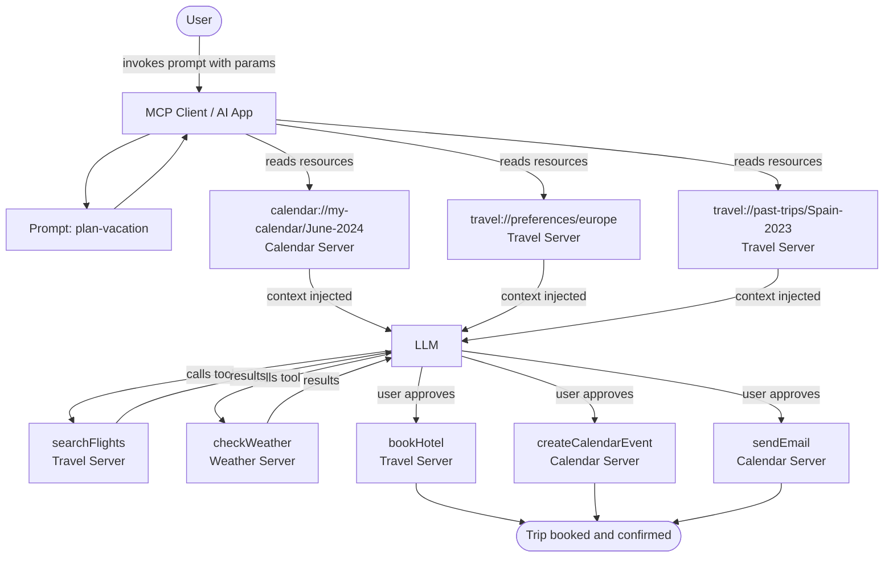

## Part 3: Model Context Protocol (MCP)

MCP (Model Context Protocol) is a standardized protocol for connecting AI models to external tools, data sources, and services. Rather than every agent system inventing its own integration layer, MCP defines a unified interface that any server can implement and any client can consume. The real power of MCP emerges when **multiple servers work together**, combining their specialized capabilities through that unified interface.

---

### Core Server Building Blocks

User --> Prompt --> Agent --> MCP Server (Tools + Resources)

Every MCP server exposes functionality through three primitives: **Tools**, **Resources**, and **Prompts**. They differ in who controls them and what they're for.

| Feature             | What it is                                                                      | Examples                                              | Controlled by |
| ------------------- | ------------------------------------------------------------------------------- | ----------------------------------------------------- | ------------- |
| **Tools**     | Functions the LLM can actively call and decides when to invoke based on context | Search flights, send messages, create calendar events | Model         |
| **Resources** | Read-only data sources that provide passive context to the model                | Company policies, Calendar, API reference             | Application   |
| **Prompts**   | Pre-built instruction templates for working with specific tools and resources   | "Review my open PRs", "summarize my tasks for today!" | User          |

**Tools** are schema-defined interfaces using JSON Schema for validation. Each tool performs a single, well-scoped operation with clearly defined inputs and outputs. Tools may require user consent before execution, ensuring users stay in control of actions taken on their behalf.

**Resources** provide structured, read-only access to information -- things like file contents, database schemas, or API documentation -- that the application retrieves and injects into the model's context.

**Prompts** are reusable, parameterized templates. They allow MCP server authors to define domain-specific workflows and surface the best patterns for using their server.

---

### How Multiple MCP Servers Work Together



---

### Worked Example: Multi-Server Travel Planner

Consider a personalized AI travel planner connected to three MCP servers: a **Travel Server** (flights, hotels, itineraries), a **Weather Server** (climate data and forecasts), and a **Calendar/Email Server** (schedules and communications).

**Step 1: User invokes a prompt with parameters**

```json
{
  "prompt": "plan-vacation",
  "arguments": {
    "destination": "Barcelona",
    "departure_date": "2024-06-15",
    "return_date": "2024-06-22",
    "budget": 3000,
    "travelers": 2
  }
}
```

**Step 2: User selects resources to include as context**

- `calendar://my-calendar/June-2024` (Calendar Server) -- surfaces available dates
- `travel://preferences/europe` (Travel Server) -- surfaces preferred airlines and hotel types
- `travel://past-trips/Spain-2023` (Travel Server) -- surfaces previously enjoyed locations

**Step 3: The AI reads all resources to build context**

Before taking any action, the model reads the selected resources to understand constraints and preferences. This is the passive, read-only phase -- no side effects yet.

**Step 4: The AI executes tools (with approval where required)**

Using the gathered context, the model then invokes a sequence of tools:

1. `searchFlights()` -- queries airlines for NYC to Barcelona flights
2. `checkWeather()` -- retrieves climate forecasts for the travel dates
3. `bookHotel()` -- finds hotels within the specified budget *(user approval required)*
4. `createCalendarEvent()` -- adds the trip to the user's calendar *(user approval required)*
5. `sendEmail()` -- sends a confirmation with full trip details *(user approval required)*

The key design insight is the separation between **reading** (Resources, no approval needed) and **writing** (Tools, may require consent). This gives users meaningful control over what the agent actually does in the world.

**The result:** A task that could have taken hours -- cross-referencing calendars, comparing flights, checking weather, booking hotels, and sending confirmation emails -- is completed in minutes by combining Resources and Tools across three specialized MCP servers through a single unified interface.
