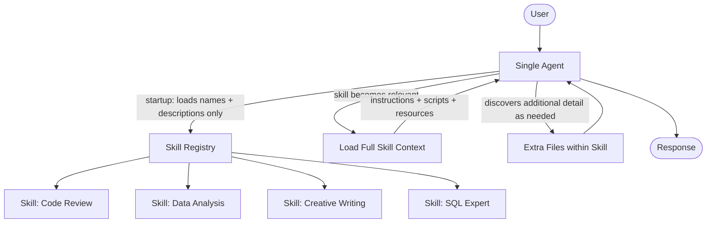
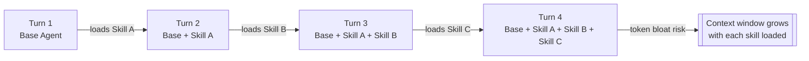
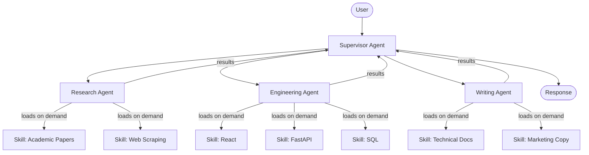

## Part 4: Skills Architecture

### Skills: Progressive Disclosure

In the skills pattern, an agent loads specialized prompts and knowledge **on-demand**. Think of it as progressive disclosure for agent capabilities -- rather than loading everything upfront, the agent only pulls in what it needs, when it needs it.

---

### Where Skills Fit

While the skills architecture technically uses a **single agent**, it shares characteristics with multi-agent systems by enabling that agent to dynamically adopt specialized personas. This gives you similar benefits to multi-agent patterns -- like distributed development and fine-grained context control -- but through a lighter-weight, prompt-driven method rather than managing multiple agent instances.

So, perhaps controversially, **skills can be considered a quasi-multi-agent architecture**.

---

### How It Works

Skills are packaged as **directories** containing instructions, scripts, and resources. Loading happens in three progressive levels:

1. **At startup** -- the agent knows only skill names and descriptions. It has a lightweight index of what's available, nothing more.
2. **When a skill becomes relevant** -- the agent loads that skill's full context: its instructions, persona, and resources. This is the on-demand disclosure step.
3. **As needed within a skill** -- additional files within the skill directory provide a third level of detail that the agent discovers only when the task requires it.

This three-level structure keeps the agent's active context lean until specialization is actually needed.

### Best For

- Single agents with **many possible specializations** that don't all need to be active at once
- Situations where you **don't need hard constraints** between capabilities
- **Team distribution** where different teams maintain different skills independently
- Common use cases: coding agents, creative assistants, or general-purpose assistants with domain plugins

---

### Key Tradeoff

As skills are loaded throughout a conversation, their context accumulates in the conversation history. This can lead to **token bloat** on subsequent calls -- the more skills that get loaded in a session, the larger the context window grows, increasing cost and potentially degrading performance.

The upside is **simplicity**: there's no inter-agent communication to manage, no routing logic, and the user interacts with a single coherent agent throughout the entire session.

---

### Real-World Examples

- **Cursor / Claude Code** -- a coding agent that loads language-specific or framework-specific skill contexts (e.g., a React skill vs. a FastAPI skill) only when the relevant files are opened.
- **General-purpose assistants** (like Claude with custom instructions) -- the base agent loads a specialized persona (legal assistant, data analyst, creative writer) only when the conversation warrants it.
- **Internal enterprise bots** -- a company assistant that has skills for HR, Finance, and Engineering maintained by separate teams, loaded on-demand based on the user's department or question type.

---

### Hybrid Model: Skills Inside Multi-Agent Systems

Skills aren't limited to single-agent setups. In practice, the most sophisticated systems combine both -- using multi-agent architecture for high-level orchestration and skills within individual agents for lightweight, on-demand specialization.

The key insight is that **skills and agents solve different granularities of the same problem**. A full subagent is worth the overhead when the specialization needs its own tools, its own reasoning loop, or hard isolation from other agents. A skill is the right call when the specialization is prompt-driven and the overhead of a separate agent isn't justified.

**Where skills plug into multi-agent systems:**

- **At the subagent level** -- each subagent stays lean by default and loads skills on-demand as the task requires. A research agent might load an "academic paper" skill or a "web scraping" skill depending on the source it needs to query. This keeps individual agents lightweight without sacrificing specialization depth.
- **At the supervisor level** -- a supervisor can use skills to switch between orchestration strategies. For example, loading a "code review workflow" skill vs. a "report generation workflow" skill depending on what it's been asked to coordinate.
- **As a substitute for lightweight subagents** -- if a specialization is prompt-driven and doesn't need its own tools or isolated reasoning loop, a skill loaded into an existing agent can do the job without the cost of spinning up a full subagent and managing inter-agent communication.

**When to use a skill vs. a full subagent:**

| Use a Skill when...                    | Use a separate Agent when...                                    |
| -------------------------------------- | --------------------------------------------------------------- |
| The specialization is prompt-driven    | The specialization needs its own dedicated tools                |
| Context isolation isn't critical       | You need hard constraints between capabilities                  |
| The subtask is lightweight             | The subtask is complex enough to warrant its own reasoning loop |
| You want to avoid inter-agent overhead | Parallel execution across agents is important                   |

**Real-world example:** Consider a software engineering agent system where a supervisor routes between a Research Agent, an Engineering Agent, and a Writing Agent. The Engineering Agent alone might need to handle React, FastAPI, SQL, and Rust depending on the project. Rather than spinning up four separate engineering subagents, the single Engineering Agent loads the relevant language or framework skill on-demand -- keeping the multi-agent graph simple at the top level while still achieving deep specialization within each node.
